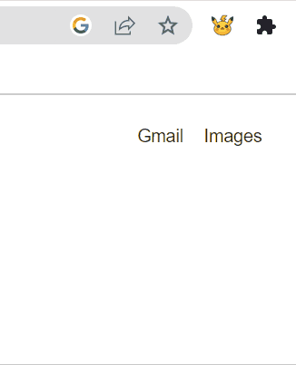

## PokeMotivation

A Chrome extension that, on click, fetches one out of 1000+ Pokemon right to the screen with an encouraging message (based on its type) to help developers get through your day.

## How to Use

After download, go to Chrome >> Manage Extensions >> Toggle to select "Developer Mode" >> Click "Load Unpacked" and upload the entire folder. 
